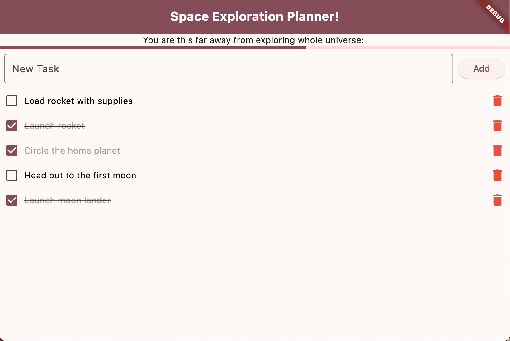

# 🌌 Space Exploration Planner

A themed to-do list app built with Flutter, where users can manage their space exploration missions!  
Add tasks, mark them as complete, delete them, and track your overall progress toward exploring the whole universe 🚀

## ✨ Features

- Add new tasks 
- Mark tasks as completed (check/uncheck)  
- Delete tasks individually  
- See overall task completion progress through a progress bar  
- Riverpod for state management

## 📦 Technologies Used

- **Flutter** (UI Framework)
- **Dart** (Programming Language)
- **Riverpod** (State Management)

## 📚 What I Learned

This was one of my first Flutter projects, developed by following a [Flutter YouTube tutorial](https://youtu.be/xWV71C2kp38?si=UYVW_7ao5qQjN4dd). Throughout the process, I gained foundational knowledge and also implemented a few additional features on my own.

### 🧠 From the Tutorial, I Learned:
- How to structure a Flutter application using custom widgets
- How to use **Riverpod** for efficient and reactive state management
- Basics of **StateNotifier** for managing and updating a list of tasks
- Techniques to build a clean and responsive UI in Flutter

### ✨ What I Added Myself:
- Implemented the ability to **add new tasks** dynamically from user input
- Added a **delete** function to remove tasks individually

This project laid the groundwork for my Flutter journey and helped me move from simply following instructions to actively building and extending apps on my own.

